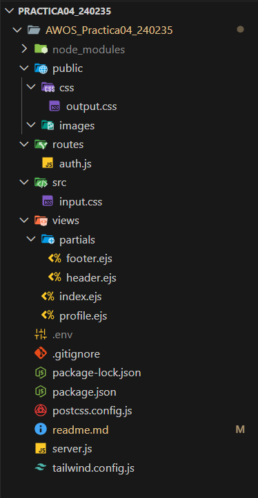
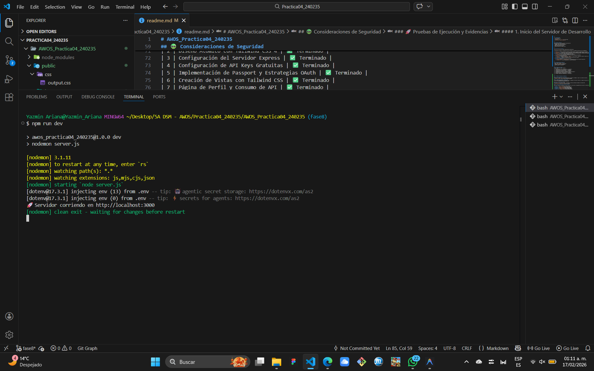
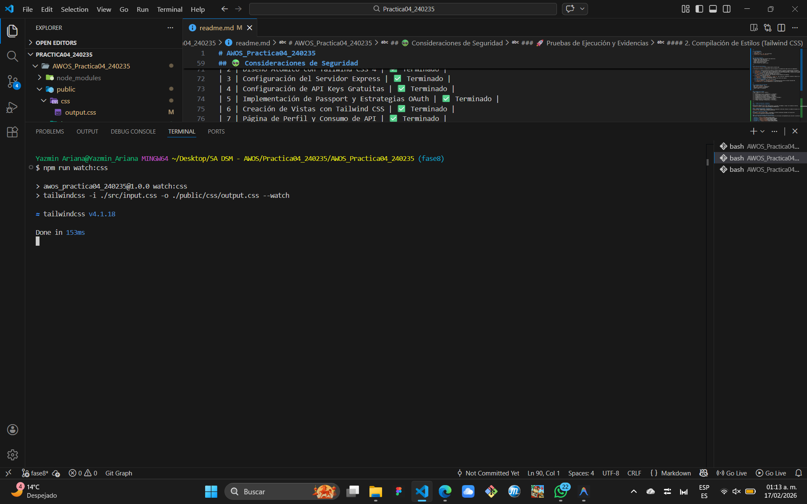
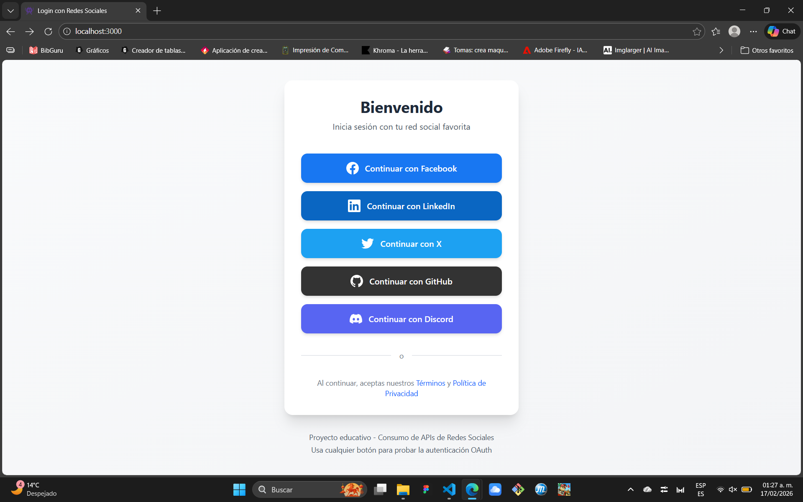
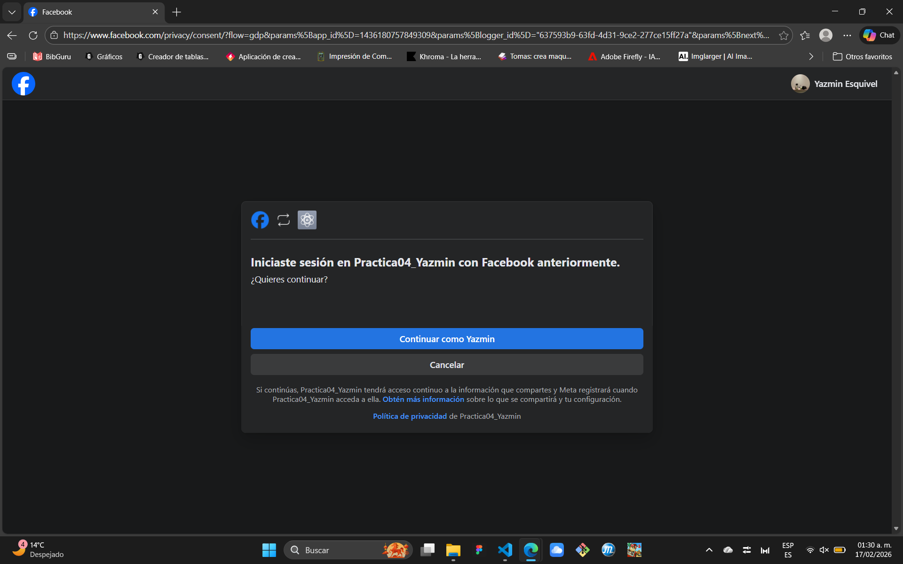
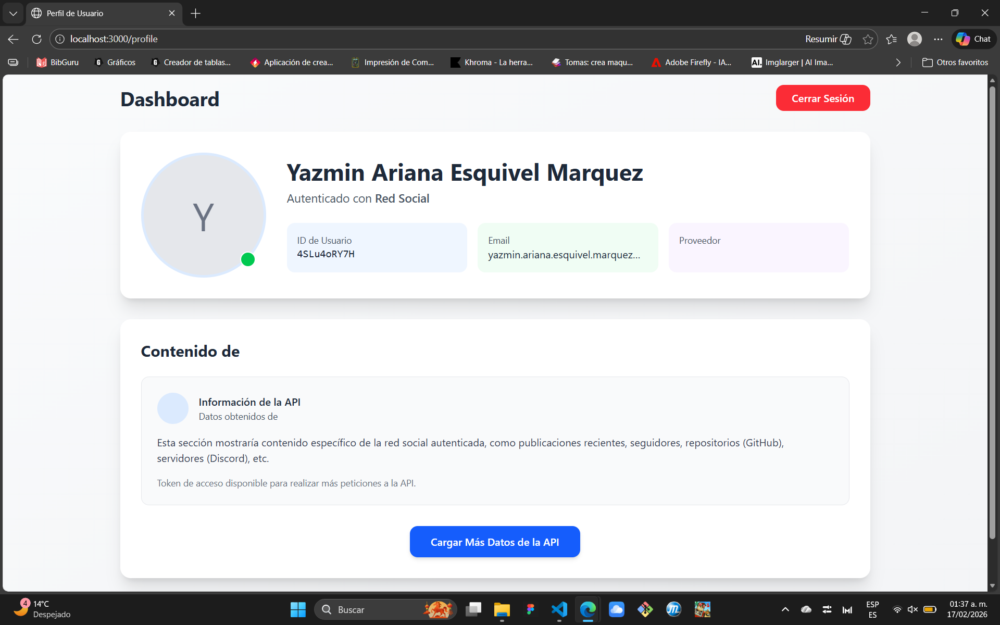
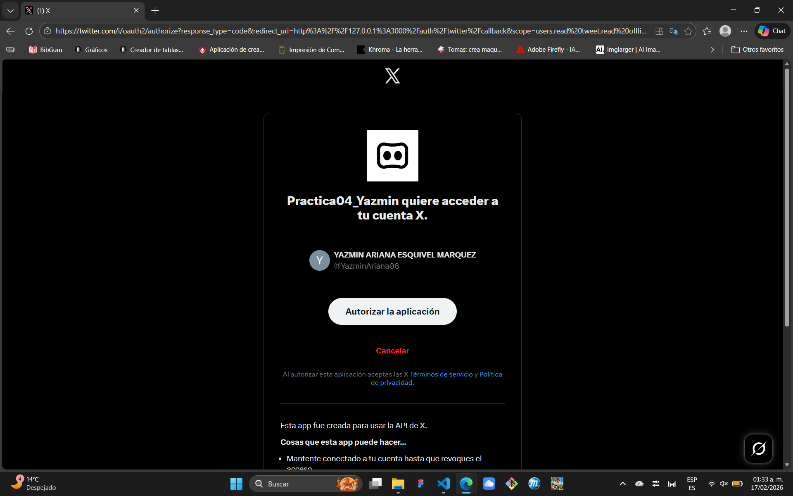
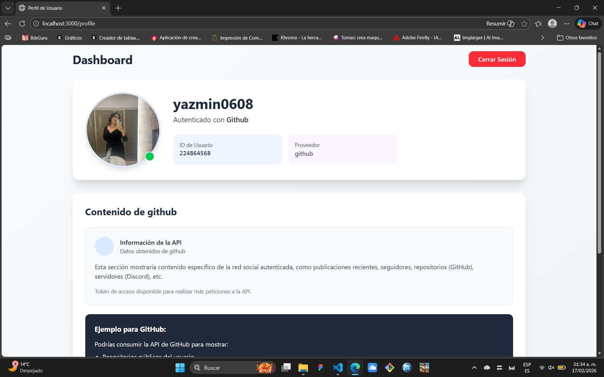
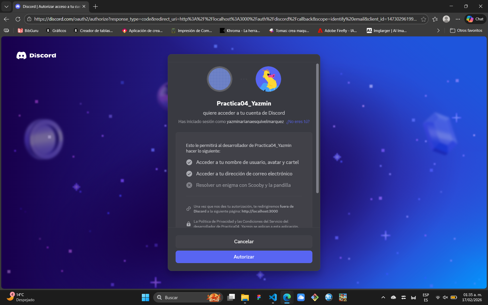

# AWOS_Practica04_240235
## Práctica 04: Consumo de APIs de Redes Sociales con OAuth

---

### 🎯 Objetivo
Implementar autenticación OAuth 2.0 con 5 redes sociales y consumir datos básicos de sus APIs.

---

### 🌐 Tecnologías
- Node.js + Express
- Passport.js + Estrategias OAuth
- Tailwind CSS 4.x
- EJS templates

---

## ⚙️ Configuración
1. Clonar repositorio
2. `npm install`
3. Configurar archivo `.env` con las API keys
4. `npm run dev` y `npm run watch:css`

---

## 🔓 API Keys Gratuitas
Cada red social ofrece nivel gratuito para desarrollo:
- Facebook: App en modo desarrollo
- LinkedIn: Uso básico con 100 usuarios
- Twitter: API v2 Essential access
- GitHub: OAuth App sin límites
- Discord: App bot con scopes básicos

---

## 🗃️ Estructura del Proyecto

A continuación se detalla la organización real del proyecto y el propósito de cada uno de sus componentes:

* **`server.js`**: Archivo principal que levanta el servidor Express y coordina la autenticación con Passport.
* **`routes/auth.js`**: Gestiona las rutas de autenticación y las estrategias de GitHub, Facebook, Discord, LinkedIn y X.
* **`src/input.css`**: Archivo fuente donde se importan las directivas de Tailwind CSS 4.x antes de ser procesadas.
* **`public/`**: Contiene los archivos procesados y estáticos:
    * **`css/output.css`**: El CSS final generado para la interfaz.
    * **`images/`**: Carpeta destinada a los recursos gráficos y capturas de evidencia.
* **`views/`**: Carpeta de plantillas EJS:
    * **`partials/`**: Contiene `header.ejs` y `footer.ejs` para reutilizar componentes visuales en todas las páginas.
    * **`index.ejs`**: Pantalla de bienvenida y login.
    * **`profile.ejs`**: Pantalla que despliega los datos del perfil del usuario.
* **Configuraciones Técnicas**:
    * **`.env`**: Almacena de forma segura las API Keys.
    * **`tailwind.config.js` y `postcss.config.js`**: Configuración del motor de diseño Tailwind CSS.
    * **`package.json`**: Lista de dependencias y scripts de ejecución.

---

## 👽 Consideraciones de Seguridad
- Nunca comitar archivos `.env`
- Usar `http://localhost` en desarrollo
- Configurar callbacks correctamente
- Limitar scopes a lo necesario

---

### 📈 Estatus de las Fases
| Fase | Nombre de la Fase | Estatus |
|---|---|---|
| 1 | Configuración Inicial y Dependencias | ✅ Terminado |
| 2 | Diseño Atómico con Tailwind CSS 4 | ✅ Terminado |
| 3 | Configuración del Servidor Express | ✅ Terminado |
| 4 | Configuración de API Keys Gratuitas | ✅ Terminado |
| 5 | Implementación de Passport y Estrategias OAuth | ✅ Terminado |
| 6 | Creación de Vistas con Tailwind CSS | ✅ Terminado |
| 7 | Página de Perfil y Consumo de API | ✅ Terminado |
| 8 | Pruebas, Despliegue y Documentación | ✅ Terminado |

---

### 🚀 Pruebas de Ejecución y Evidencias

#### 1. Inicio del Servidor de Desarrollo
Se ejecuta el comando `npm run dev` para levantar el servidor con Nodemon y cargar las variables de entorno.

#### 2. Compilación de Estilos (Tailwind CSS)
En una terminal independiente, se mantiene activo el compilador de CSS para reflejar los cambios de diseño en tiempo real.

#### 3. Vista de Bienvenida (Index)
Al acceder a `http://localhost:3000`, se presenta la interfaz profesional diseñada con Tailwind CSS.

#### 4. Flujo de Autenticación (Portales Externos)
Cada botón redirige correctamente al portal oficial de la red social correspondiente para solicitar la autorización del usuario:

* **Facebook:** 
* **LinkedIn:** 
* **Twitter (X):** 
* **GitHub:** 
* **Discord:** 

---

### ⌨️ Conclusión del Proyecto
Culminar la Práctica 04 fue un reto de integración técnica y perseverancia.
A lo largo de estas 8 fases, logré:

- Implementar Autenticación Robusta: Conectamos con éxito 5 plataformas (Facebook, LinkedIn, X, GitHub y Discord), superando cambios críticos en sus APIs como el paso a OpenID Connect.

- Diseño Profesional: Se Transformó la experiencia de usuario usando Tailwind CSS para crear una interfaz moderna, limpia y responsiva.

- Flujo de Trabajo Real: Se utilizó Git y ramas por fases para mantener un código organizado y libre de errores.

Este proyecto demuestra una gran capacidad para resolver problemas complejos y unir diversas tecnologías en una aplicación funcional y segura. ¡Misión cumplida!
